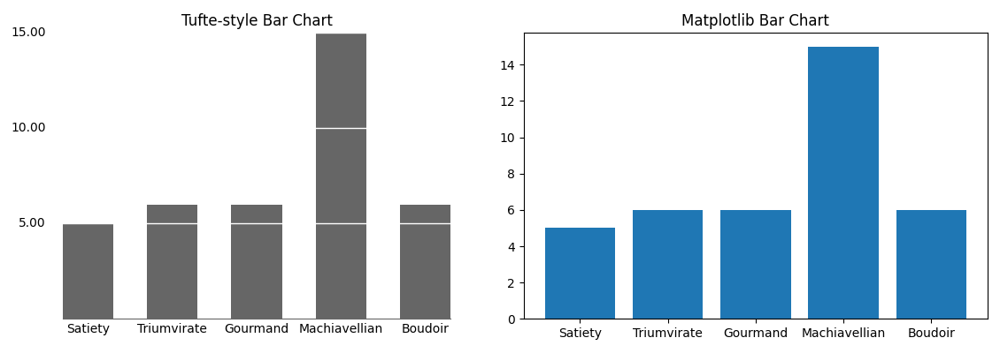
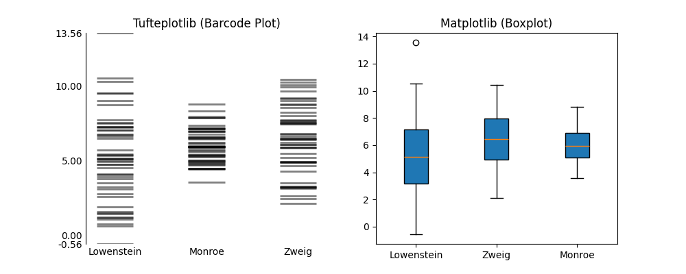
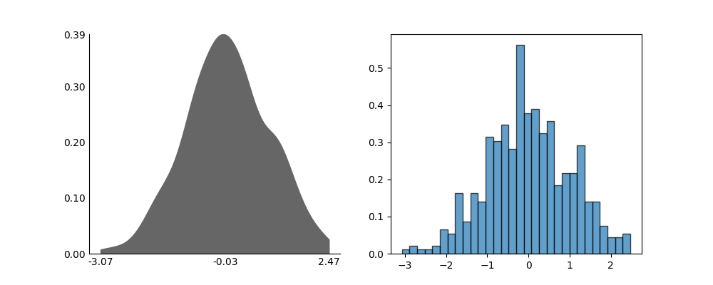
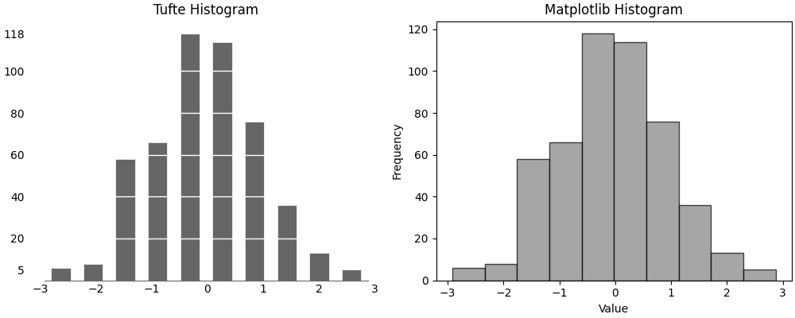
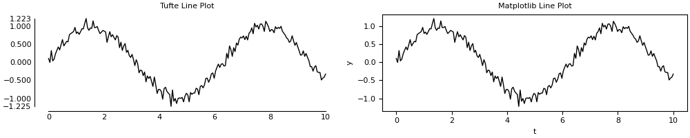
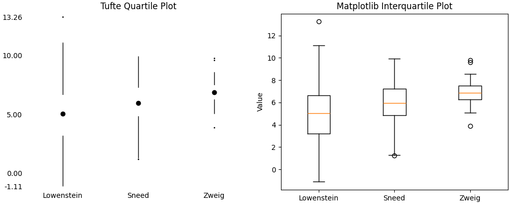
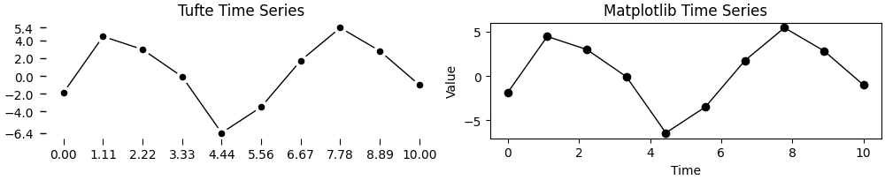

# tufteplotlib

**tufteplotlib** is a Python library for generating plots & graphs in a minimamilist style proposed by Edward Tufte.

  
  
   
  
  
   
  
  
  

|  Stem | Leaves |
|------:|:-------|
|     5 | .03 .10 .13 .89 |
|     6 | .39 .45 .63 .95 |
|     7 | .48 .84 |
|     8 | .11 .14 .19 .59 .69 .72 .99 |
|     9 | .04 .08 .28 .38 .49 .90 |
|    10 | .13 .17 .20 .55 .73 .95 |
|    11 | .32 .78 |
|    12 | .35 .36 .58 .70 .96 .99 |
|    13 | .02 .22 .25 .58 .60 .60 .66 .79 .86 |
|    14 | .43 .78 .85 .96 |
