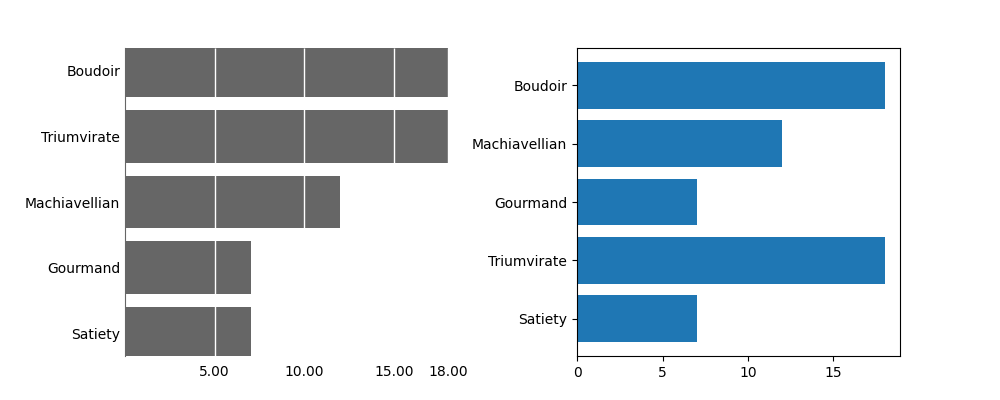
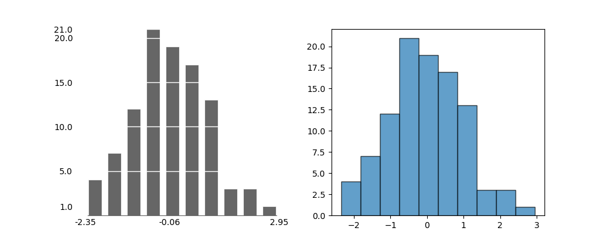
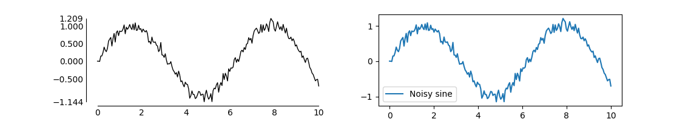
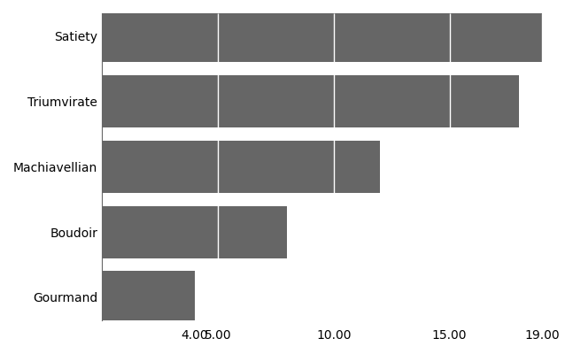
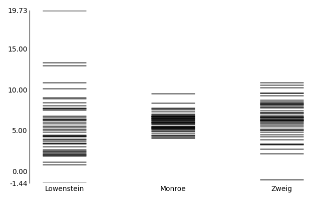
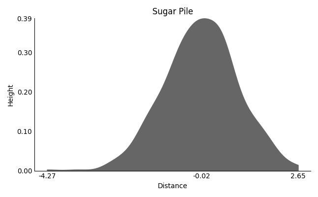
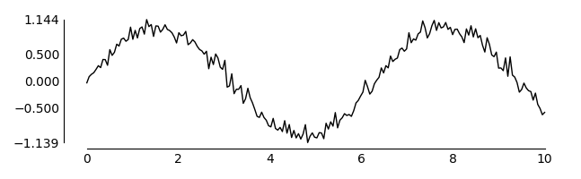
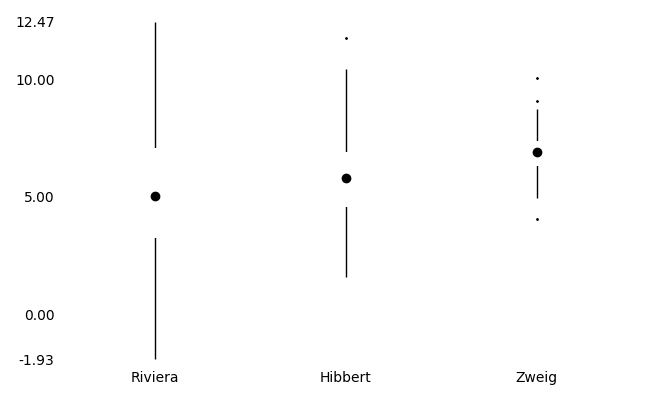
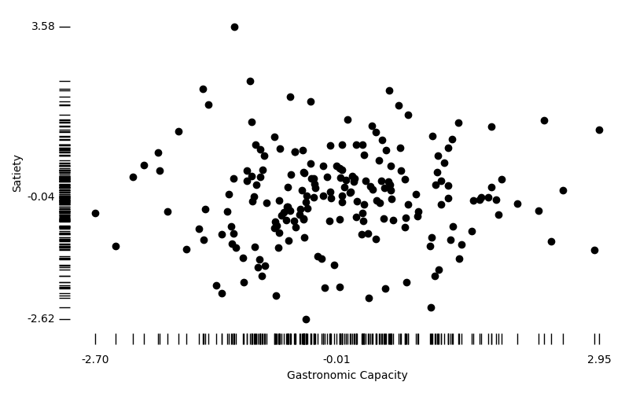
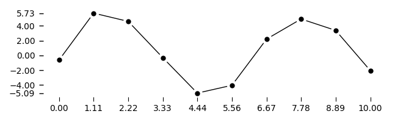

# tufteplotlib  
Minimalist plotting for Python, inspired by Edward Tufte’s principles of data visualization.

`tufteplotlib` is a Python library built on top of [matplotlib](https://matplotlib.org/) for generating minimalist, high–data-density graphs in the style proposed by Edward Tufte in [*The Visual Display of Quantitative Information*](https://www.edwardtufte.com/book/the-visual-display-of-quantitative-information/).

<p align="center">
  
</p>

---

## ✨ Tufte principles

Tufte promotes:

- **Maximising the data–ink ratio**: remove non-essential lines, marks, and colours.  
- **Content-driven spines and axes**: spines span only the data domain and range, for rapid inspection.  
- **Minimal scaffolding**: grid lines, ticks, and labels are light, precise, and unobtrusive.  
- **Direct labeling**: wherever possible, place labels on the data rather than in legends.  

---

#### 🧭 Navigation:
- [Examples](#-examples)
- [Installation](#-installation)
- [Contributing](#-contributing)
- [License](#-license)
- [Plots](#-plots)
  - [Bar](#bar)
  - [Barcode](#barcode)
  - [Density](#density)
  - [Galaxy](#galaxy)
  - [Histogram](#histogram)
  - [Line](#line)
  - [Quartile](#quartile)
  - [Rug](#rug)
  - [Sparkline](#sparkline)
  - [Stem and Leaf](#stem-and-leaf)
  - [Time](#time)

---

## 🔎 Examples

Here is a small gallery of common plots using `tufteplotlib` on the left, versus default rendering in `matplotlib` on the right:

<p align="center">
  
  <br>
  
  
  <br>
  
  
  <br>
  
  <br>
  
</p>

[🔝 Back to Top.](#tufteplotlib)

---

## 💾 Installation

`tufteplotlib` is currently available only from GitHub. You can install it directly using:

```
pip install git+https://github.com/yourusername/tufteplotlib.git
```

Or clone the repo and install locally:

```
git clone https://github.com/yourusername/tufteplotlib.git
cd tufteplotlib
pip install -e .
```

To confirm the library is installed correctly, run the following:

```
pip show tufteplotlib
```

and you should see something like:

```
Name: tufteplotlib
Version: 0.1.0
Summary: An extension to matplotlib for creating graphs in the style of Edward Tufte.
Home-page: https://github.com/Woolfrey/software_tufte_plot
Author: Jon Woolfrey
Author-email: jonathan.woolfrey@gmail.com
License: GPLv3
Location: /home/woolfrey/.local/lib/python3.10/site-packages
Requires: matplotlib, numpy, pandas
Required-by: 
```

You can even run commands such as `tufte-scatter`, `tufte-time` etc to execute example code.

[🔝 Back to Top.](#tufteplotlib)

---

## 🤝 Contributing

> [!NOTE]
> I am not a software engineer, so contributions to improving `tufteplotlib` are welcome!

- **Report issues:** If you find a bug, unexpected behavior, or have a feature request, open an [issue](../../issues).  
- **Fork & pull request:** Fork the repository, make your changes, and submit a pull request.  
- **Code style:** Please follow the minimalist Tufte style — keep your changes clean and avoid unnecessary visual clutter.  
- **Documentation:** Examples, explanations, and README improvements are highly appreciated.  
- **Testing:** Ensure that your code changes do not break existing functionality. Add small example plots if relevant.

[🔝 Back to Top.](#tufteplotlib)

---

## 📜 License

`tufteplotlib` is released under the [GNU General Public License v3.0](https://www.gnu.org/licenses/gpl-3.0.en.html).  
You are free to use, modify, and distribute this software under the terms of the GPLv3.  
See the included [LICENSE](LICENSE) file for full details.

[🔝 Back to Top.](#tufteplotlib)


## 📊 Plots

### Bar

_Compare quantities across nominal categories._

To see a full example, run `tufte-bar` in the terminal.

<p align="center">
  
</p>

✨ Features:
- Spines removed;
- Thin white lines for y-axis ticks;
- Tick marks for minimum and maximum values.

Minimal example:

```python
import numpy as np
from tufteplotlib import bar_chart

categories = ["Satiety", "Triumvirate", "Gourmand", "Machiavellian", "Boudoir"]
values = np.random.randint(3, 20, size=len(categories))

fig, ax = bar_chart(categories, values)
plt.tight_layout()
plt.show()
```

[🔝 Back to Top.](#tufteplotlib)

### Barcode

<p align="center">
  
</p>

[🔝 Back to Top.](#tufteplotlib)

### Density

<p align="center">
  
</p>

[🔝 Back to Top.](#tufteplotlib)

### Galaxy

<p align="center">
  
</p>

[🔝 Back to Top.](#tufteplotlib)

### Histogram

<p align="center">
  
</p>

[🔝 Back to Top.](#tufteplotlib)

### Line

<p align="center">
  
</p>

[🔝 Back to Top.](#tufteplotlib)

### Quartile

<p align="center">
  
</p>

[🔝 Back to Top.](#tufteplotlib)

### Rug

<p align="center">
  
</p>

[🔝 Back to Top.](#tufteplotlib)

### Sparkline

<p align="center">
  
</p>

[🔝 Back to Top.](#tufteplotlib)

### Stem and Leaf

|  Stem | Leaves |
|------:|:-------|
|     5 | .03 .10 .13 .89 |
|     6 | .39 .45 .63 .95 |
|     7 | .48 .84 |
|     8 | .11 .14 .19 .59 .69 .72 .99 |
|     9 | .04 .08 .28 .38 .49 .90 |
|    10 | .13 .17 .20 .55 .73 .95 |
|    11 | .32 .78 |
|    12 | .35 .36 .58 .70 .96 .99 |
|    13 | .02 .22 .25 .58 .60 .60 .66 .79 .86 |
|    14 | .43 .78 .85 .96 |

### Time

<p align="center">
  
</p>

[🔝 Back to Top.](#tufteplotlib)
